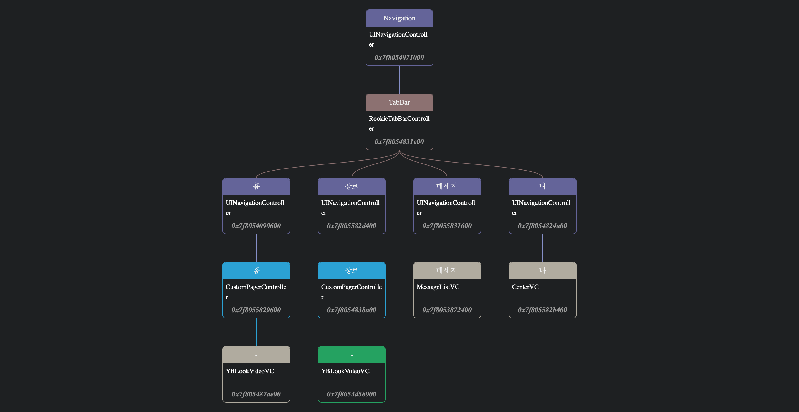

##  RookieTabbarControl
- 홈 , CustomPageController
	- YBLookVideoVC
- 장르, CustomPageController
	- YBLookVideoVC
- **MimTok Publish Button**
	- centerBtnDidClicked() 
		```objc
		[YBLiveOrVideo showLiveOrVideoSel];
		```
- 메세지, MessageListVC
- 나, CenterVC

##  YBLookVideoVC
- `iphoneLive - MainVideo - Recomment` folder
- 중국산 [ZFPlayer](https://github.com/renzifeng/ZFPlayer) 를 video controller 로 사용
	- ZFPlayer는 obj-c 코드로 당장에는 크게 문제는 없으나 swift code로 변경해야함
	- 내부 player로 Apple의 기본 AVFoundation 의 AVPlayer 대신 중국산 [ijkplayer](https://github.com/bilibili/ijkplayer) 를 사용
	- ijkPlayer는 ffmpeg의 ffplay를 기반으로한 멀티포맷, 멀티코덱을 andorid, ios 동시 대응하기 위해 만든것 
	- mp4, h264만 지원하면 되면 구지 필요없는 over spec
	- AVPlayer로 교체하면 Performance 향상과 많은 issue가 해결됨
	- thumbnail image를 server에서 모두 받아와서 보여줌
		- 다음과 같은 코드로 해결하자. 
		```swift

private func createVideoThumbnail(from url: URL) -> UIImage? {

    let asset = AVAsset(url: url)
    let assetImgGenerate = AVAssetImageGenerator(asset: asset)
    assetImgGenerate.appliesPreferredTrackTransform = true
    assetImgGenerate.maximumSize = CGSize(width: frame.width, height: frame.height)

    let time = CMTimeMakeWithSeconds(0.0, preferredTimescale: 600)
    do {
        let img = try assetImgGenerate.copyCGImage(at: time, actualTime: nil)
        let thumbnail = UIImage(cgImage: img)
        return thumbnail
    }
    catch {
      print(error.localizedDescription)
      return nil
    }

}

		```

## YBLiveOrVideo 
- `RecordAndEditPlay`  folder에  `TCVideoRecordViewController` class
- TXLiteAVSDK_Professional, MHBeauty 두개의 중국산 라이브러이의 기능에 대부분 의존한다. 
	- `TC` 접두어로 시작하는 class들은 모두 해당
- 이부분은 새로 개발하기도 비용이 많이 들고 교체도 쉽지 않다.
- 새로운 기능추가같은것이 불가능 -->  장기적으로는 반드시 재개발해야 함. 

		