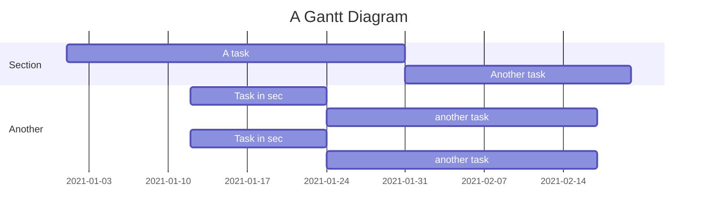

- https://medium.com/zrealm-ios-dev/xcode-%E7%9B%B4%E6%8E%A5%E4%BD%BF%E7%94%A8-swift-%E6%92%B0%E5%AF%AB-run-script-41c49a75a743
   - 중국어로 된 medium article 이긴 한데 xcode에서 사용하는 swift script에 대한 글
   - localize, asset 정리에 대한 script
      - #medium #xcode #swiftLang 
 - [[PlayingVideoUsingAVPlayer]]

## Mimtok recording meeting
- Mimtok 관련
- transcoding 
   - 10240 bps 
   - tiktok의 결과영상값 확인
- 촬영 editing
   - zoom 
```
솔직히 매우 불편하네요

편집을 따로해서 올리는게 아닌이상
딜레이 화면 흔들림
버튼활성화/ 화면줌 
아직 부족한점이 많아요

특히 화면이 써본 어플중 

가장 어색하고 보기싫은 얼굴 느낌으로 나오네요ㅠ

스티커도 초딩들이나 사용할법한 허접...

보이스 오버기능도 따로 없는듯하고

화면이 많이 끊겨요(흔들림 극대화)

장점은 음원이 세련된곡이 많다는건데

전반적이게 고칠게 많아 보이네요..!
```

- #meeting 

- 20120209 밈톡 미팅 #meeting 
   - ios event (naver webtoon )
   - like animation
   - touch 개선



